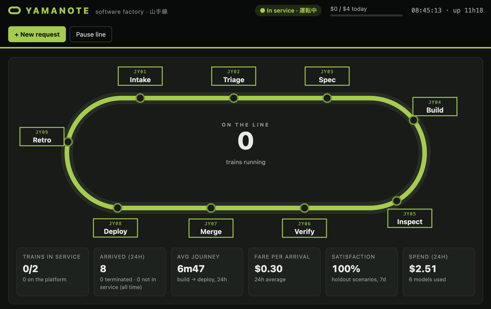
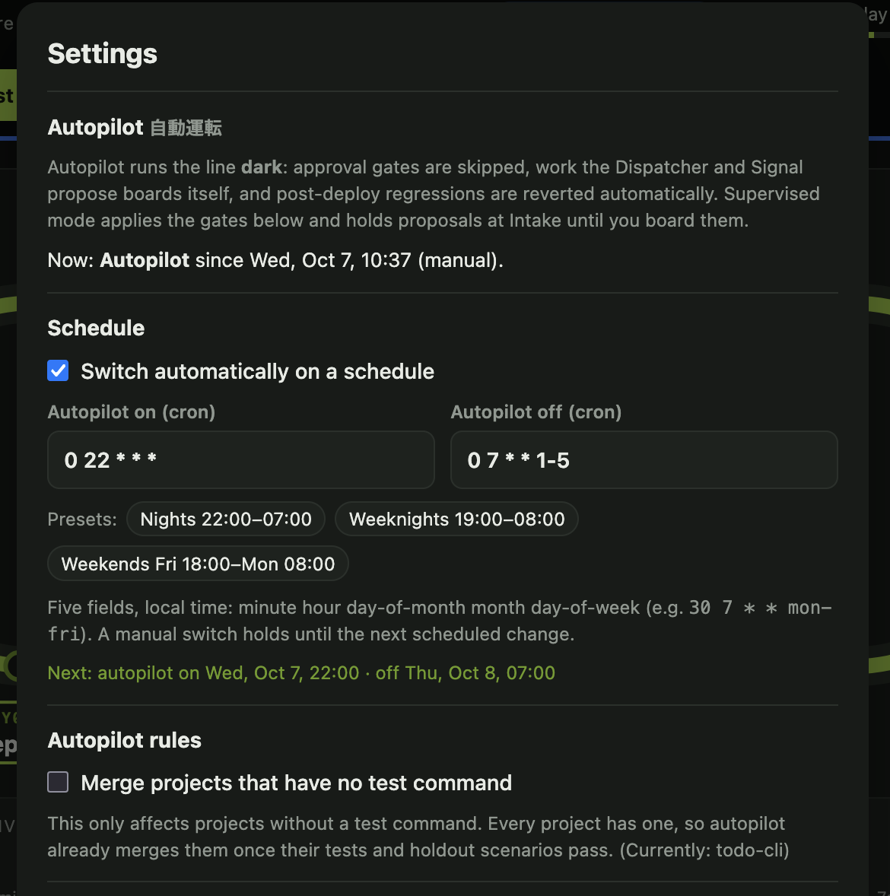
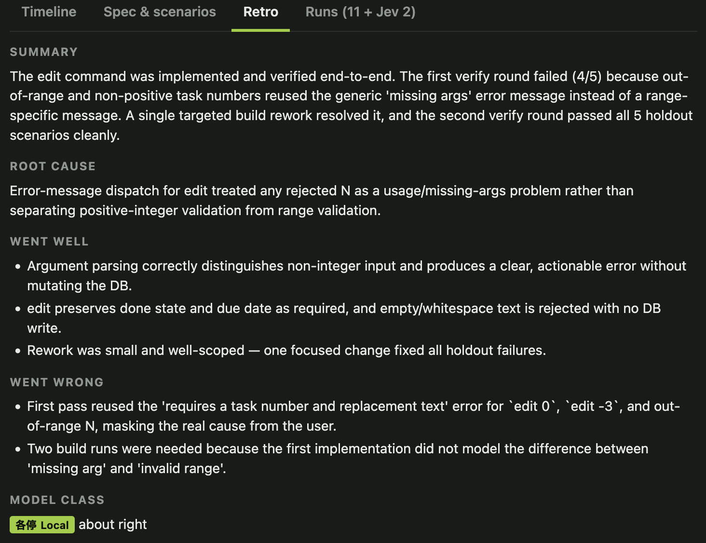
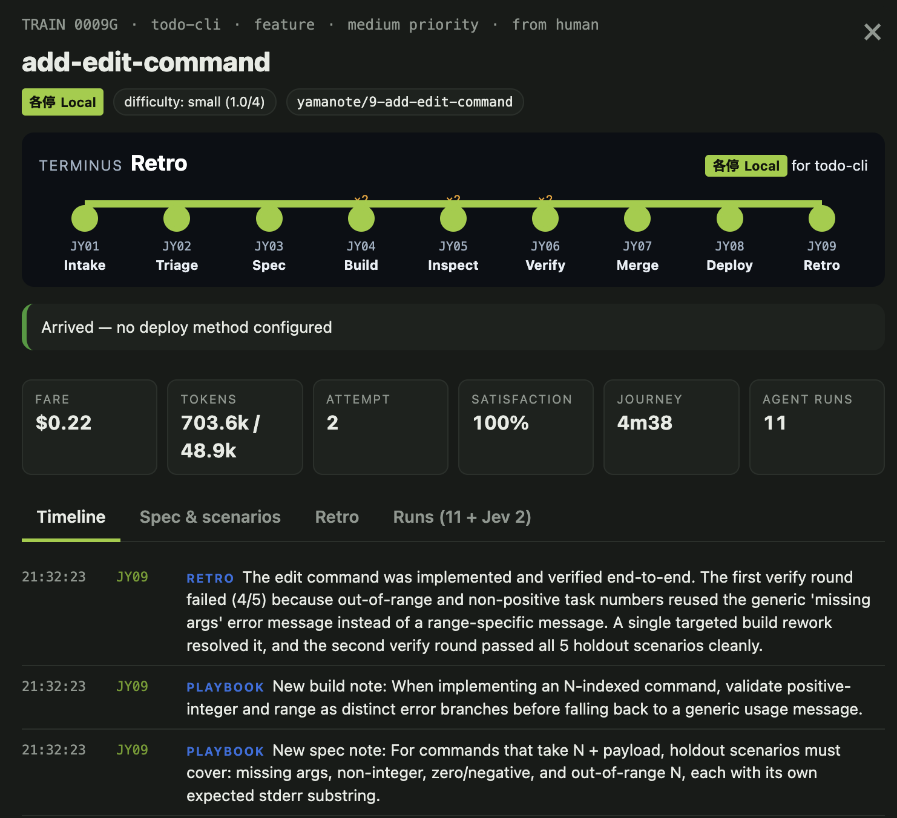
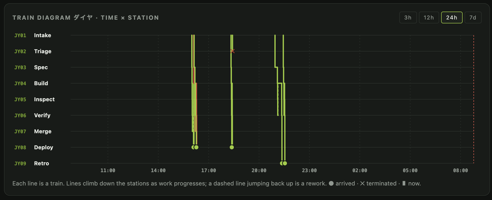
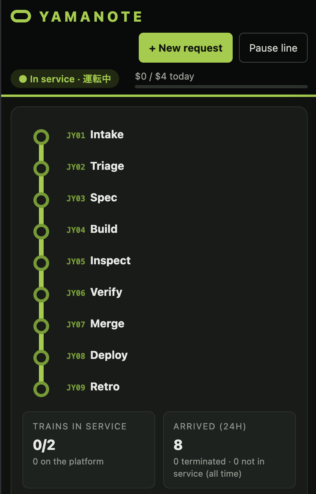

# Yamanote


A software factory that runs on the loop line. Work items are **trains**: each one
boards at Intake and travels a fixed line of **stations** — triage, spec, build,
inspect, verify, merge, deploy — with an AI agent working at each stop, and ends its
journey at a **retrospective** that teaches the next train. Production signals feed new
work back to Intake, closing the loop.

Agents run on [OpenRouter](https://openrouter.ai) through a native tool-calling loop
(no CLI subprocesses), so any model can work any station and every token, tool call
and cent is tracked per work item. Cheap typed decisions — how hard is this? is it a
duplicate? which files matter? is this log error real? — go to
[Jev](https://jevtypesafeai.com/jev/api) via `decide` (`~/development/decide`) first, and
LLM tokens are spent only where Jev is unsure.

Stdlib-only Python 3.11+, no build step for the UI. Built to run unattended on a
Raspberry Pi (or any machine) as a systemd service.



## Contents

- [The line](#the-line) · [Service classes](#service-classes) · [Line-wide crew](#line-wide-crew)
- [Autopilot](#autopilot-自動運転) · [Checks and the merge queue](#checks-and-the-merge-queue)
- [Retrospective & continuous learning](#retrospective--continuous-learning)
- [Post-deploy watch](#post-deploy-watch) · [Notifications](#notifications-hooks)
- [Dashboard](#dashboard) · [API](#api)
- [Getting started](#getting-started) · [Configuration](#configuration) · [Guardrails](#guardrails)
- [Upgrading from the old orchestrator](#upgrading-from-the-old-orchestrator) · [Development](#development)

## The line

| | Station | What happens | Default model |
|---|---|---|---|
| JY01 | **Intake** | Work arrives from the **Dispatcher** (surveys the codebase), **Signal** (watches app logs), or a human via the dashboard | Rapid |
| JY02 | **Triage** | Jev scores usefulness, readiness, duplication and difficulty. Clear-cut cases are decided by Jev alone; the rest go to an LLM gate (BUILD / REJECT / HOLD). Human requests skip the gate | Jev, then Local |
| JY03 | **Spec** | Acceptance criteria, an implementation plan, relevant files (Jev-ranked), and 2–5 **holdout scenarios** that are sealed from the builder. Optional human gate | Rapid |
| JY04 | **Build** | Builder agent implements in its own git worktree; the factory commits, then runs the project's **test command** (free, no model) and sends the train straight back if it fails | the train's class |
| JY05 | **Inspect** | Code review of the diff against the spec; approves or sends the train back with specific issues | one class up |
| JY06 | **Verify** | A separate verifier executes the holdout scenarios against the build. **Satisfaction** = scenarios passed / runnable. Below the threshold, the train returns to Build with the *observed behaviour*, never the scenario script | Rapid |
| JY07 | **Merge** | Optional human gate, then the **merge queue**: one train per project at a time merges the latest trunk into its branch, re-runs the tests on the combination, then lands. Conflicts go back to the builder; the result is re-inspected, re-verified and re-approved | — |
| JY08 | **Deploy** | Service restart or Railway staging → production, then a **post-deploy watch** of the app logs | — |
| JY09 | **Retro** | Every journey — arrived or failed — ends with a **retrospective** that writes per-station playbook notes for the next train, retires notes that aren't helping, and judges the model class | Rapid |

**Holdout scenarios** are the core of the factory's quality gate: an agent that
writes both the code and the tests can make "tests pass" meaningless, so the
end-to-end checks are written up front by a different agent and never shown to the
builder ([background](https://simonwillison.net/2026/Feb/7/software-factory)).

- When a scenario fails, a cheap **Redactor** rewrites the verifier's observations as
  behavioural defects ("listing an empty file prints a blank line; it should print
  nothing") so the builder learns *what* is wrong without learning *how it is checked*.
- If a scenario is itself wrong — its expected result contradicts its own steps or the
  acceptance criteria — the verifier can **dispute** it with its reasoning. Disputed
  scenarios are excluded from satisfaction and shown as ⚠ DISPUTED in the train's
  timeline, for at most half of a train's scenarios; dispute more than that and they
  all count as failures. Retrospectives use disputes to teach the spec writer.

A train gets up to 4 build attempts (3 reworks); from the third, it moves up a service
class each time.

### Service classes

Each train's **service class** picks the model it runs on. Jev scores the item's
difficulty at Triage; repeated rework escalates the train.

| Class | | Used for | Default model |
|---|---|---|---|
| Local | 各停 | trivial / small | `deepseek/deepseek-v4-pro` |
| Rapid | 快速 | moderate | `minimax/minimax-m3` |
| Limited Express | 特急 | hard / very hard | `anthropic/claude-sonnet-5.5` |
| Shinkansen | 新幹線 | escalation only | `anthropic/claude-opus-5.5` |

Train numbers carry the class the train departed in (`0042G` Local, `K` Rapid, `E`
Limited Express, `S` Shinkansen) and keep it even if the train escalates.

**Adaptive routing** (`AGENT_TEAM_ADAPTIVE_ROUTING=1`, off by default): with 5+
finished items, a difficulty level whose class passes first time less than 50% of the
time — or that retrospectives mostly call too weak — is moved up a class; one passing
over 90% first time, or that retrospectives call overkill, tries a class cheaper. It
never auto-routes to Shinkansen. The routing card on the dashboard shows the history
either way.

Override any class or station in `models.json` (see `models.json.example`). Station
values are a class name, `builder` (the train's class), `builder+1`, or a literal
OpenRouter model id. Every call lists `openrouter/auto` as a fallback
(`YAMANOTE_FALLBACK_MODEL`).

### Line-wide crew

- **Dispatcher** keeps the line fed: when trains are free it proposes the single most
  valuable change for the scheduled project, aware of what is in flight, built,
  recently rejected, and its own playbook notes.
- **Signal** tails app logs (or Railway). New ERROR/Traceback bursts are screened by
  Jev ("actionable? already tracked?") before an LLM files a bug.
- **Operations** writes an hourly digest of the line with recommendations drawn from
  the real settings list. It does not edit code.

## Autopilot 自動運転

The line runs in one of two modes, switched from the **Autopilot** toggle in the
dashboard header or on a schedule:

| | Supervised (運転中) | Autopilot (自動運転) — "dark" |
|---|---|---|
| Spec / merge approval gates | As configured in Settings (per-project `gates` in projects.json win) | Skipped |
| Work proposed by the Dispatcher or Signal | Waits at Intake until a human clicks **Board** (or **Decline**) | Boards itself |
| Your own requests | Run as usual | Run as usual |
| Post-deploy regressions | Filed as linked bugs | Filed **and reverted** automatically |
| Projects without a test command | Merge per the gates | Stop at the merge gate, unless **Merge projects that have no test command** is on |

Turning autopilot on **releases trains already waiting** at a gate (under the rules
above). Turning it off posts a **"while you were away"** report — trains arrived,
failed and not in service, regressions and reverts, new playbook notes, spend, and
what's now waiting for you — as a dashboard banner, a line announcement and an
`autopilot` notification, so it's on your phone in the morning.

**Settings (⚙ in the header)** holds the schedule — two cron expressions in local time,
one to switch autopilot on and one to switch it off, e.g. `0 22 * * *` and
`0 7 * * 1-5`, with presets for nights, weeknights and weekends — plus the
merge-without-tests rule and the Supervised gates. It works like a thermostat: a manual
switch holds until the next scheduled change, and saving a new schedule puts the line
into whatever mode it says for right now. The schedule catches up after the machine
sleeps. Settings are stored in the database; `AGENT_TEAM_AUTOPILOT*` environment
variables only seed them on first start. Open Settings directly with `/#settings`.

A short pause still outranks either mode: **Pause line** stops departures in both.

<p align="center">
  
</p>

## Checks and the merge queue

Give each project its own commands in `projects.json` (or `AGENT_TEAM_SETUP_CMD` /
`AGENT_TEAM_TEST_CMD` for a single project):

```json
{"projects": {"my-app": {"path": "~/development/my-app",
                         "setup": "npm ci",
                         "test": "npm test -- --watchAll=false"}}}
```

- **setup** runs once per worktree — dependencies are git-ignored, so a fresh worktree
  has none (`npm ci`, `uv sync`, `python3 -m venv .venv && .venv/bin/pip install -r requirements.txt`).
- **test** runs after every build, before any reviewer tokens are spent, and again in
  the merge queue on branch + latest trunk, so two trains that each pass alone can't
  break trunk together. Without a test command the queue still merges trunk in first,
  but lands without an integration check (the dashboard shows "NO TESTS").

Checks appear in each train's Runs tab as free `checks` runs with their output. Their
time limits are `AGENT_TEAM_SETUP_TIMEOUT` (900s) and `AGENT_TEAM_TEST_TIMEOUT` (600s).

## Retrospective & continuous learning

Every train that arrives or fails stops at **JY09 Retro** before its journey closes.
Rejected and cancelled trains skip it, and Cancel on a train in retro skips the
retrospective but keeps its outcome. The retrospective reads the whole journey — time
and cost per station, reworks and why, check and scenario results, disputes,
conflicts, the model class — and the project's current **playbook**, then records:

- a summary, what went well and wrong, and the **root cause** of any rework or failure;
- up to three **playbook notes**, each addressed to one station (dispatcher, triage,
  spec, build, inspect, verify). Future trains on that project get each station's notes
  in that station's prompt — the spec writer learns to pin down error messages, the
  builder learns the project's conventions, the verifier learns what to double-check;
- notes to **retire** when the journey shows they're wrong or not helping;
- a **class fit** verdict (too weak / right / overkill) that feeds adaptive routing.

Notes are measured: each counts the trains that ran with it and how many arrived
without rework. A note used by 8+ trains with under 30% first-pass success is retired
automatically, and each station keeps at most 6 (the weakest makes room). The
dashboard's **Retrospectives & playbook** card shows recent retros and every note with
its record; remove any note with ×.

A retrospective usually costs well under a cent. If the model returns an empty or
template answer it retries once a class up (a few cents). It runs even for a train that
exhausted its budget — learning why matters most then — never holds a train set, and
if it fails the journey simply closes. `AGENT_TEAM_RETRO=0` turns it off.



## Post-deploy watch

For `AGENT_TEAM_DEPLOY_WATCH_SECONDS` (default 15 min) after each deploy, Signal
compares new log errors against the error signatures seen in the previous 24 hours.
Anything new is filed straight away as a high-priority bug linked to the train that
just deployed (no model call needed; the bug then goes through triage like any other),
and a `regression` notification fires. With `AGENT_TEAM_AUTO_REVERT=1` the merge is
also reverted on trunk and redeployed. Signature history is kept in memory, so the
first watch after a restart has a smaller baseline.

## Notifications (hooks)

Yamanote doesn't talk to any messaging service directly; it hands events to a hook you
own. Configure either or both:

```bash
# A command: the event JSON arrives on stdin; YAMANOTE_EVENT, YAMANOTE_TITLE,
# YAMANOTE_MESSAGE, YAMANOTE_URL and YAMANOTE_ITEM_ID are set in its environment.
AGENT_TEAM_NOTIFY_CMD='your-signal-cli send "$YAMANOTE_TITLE: $YAMANOTE_MESSAGE $YAMANOTE_URL"'
# A webhook: receives the same JSON as a POST.
AGENT_TEAM_NOTIFY_WEBHOOK=https://example.com/hooks/yamanote
AGENT_TEAM_NOTIFY_EVENTS=gate,failed,suspended,regression,reverted,stalled,autopilot   # the default
AGENT_TEAM_PUBLIC_URL=http://raspi-5.local:8080    # used for deep links in messages
```

| Event | When |
|---|---|
| `gate` | A train is waiting for spec or merge approval, or a proposal is waiting to be boarded |
| `failed` | A train was terminated (gave up, SLA, persistent conflict, over budget) |
| `done` | A train arrived (off by default) |
| `suspended` | Departures stopped: daily budget, out of OpenRouter credit, rate limits, network down |
| `regression` | New errors appeared in the app logs soon after a deploy |
| `reverted` | A merge was reverted automatically |
| `stalled` | A project's dispatcher paused after repeated rejections |
| `autopilot` | Autopilot switched on or off; switching off carries the "while you were away" report |

Payload:

```json
{"event": "gate", "title": "Yamanote: #12 waiting for merge approval",
 "message": "add-csv-export — Signal at red — waiting for human merge approval",
 "url": "http://raspi-5.local:8080/#item-12", "ts": 1791320000.0,
 "item": {"id": 12, "title": "add-csv-export", "kind": "feature", "project": "/home/pi/development/my-app",
          "station": "merge", "status": "waiting", "service_class": "local", "cost_usd": 0.21,
          "attempt": 1, "branch": "yamanote/12-add-csv-export"},
 "data": {}}
```

`url` is present only when `AGENT_TEAM_PUBLIC_URL` is set; `item` only for train events.
Hooks run on a background thread with a 30s timeout; failures show up as line
announcements and never stall the line.

## Dashboard



- **The loop** — live line map of all nine stations; trains sit at their station, glow
  while an agent is working, and show a red signal when waiting at a human gate. Below
  900px wide it becomes a vertical line diagram with tappable train chips.
- **KPIs** — trains in service, arrivals, average journey, fare per arrival, holdout
  satisfaction, 24h spend.
- **Train diagram (ダイヤ)** — the classic timetable chart: time across, stations down,
  one line per train over the last 3h / 12h / 24h / 7d. Bottlenecks show up as long
  flat runs; reworks as dashed jumps back up the line.
- **Departures / Arrivals boards** — every work item with its service class, current
  station, status (on time, rework, delayed, signal, proposed, reflecting), journey time
  and fare.
  Columns drop away gracefully as the board narrows.
- **Train drawer** (click any train) — door-LCD route strip, gate Approve/Reject,
  Cancel/Retry, fare/tokens/attempts/satisfaction, and tabs for the event timeline, the
  spec with its sealed scenarios and per-scenario evidence, the Retro, and every agent
  run with its tool calls streaming live.
- **Crew & signals** — Dispatcher/Signal/Ops/Jev status, each project's checks and
  post-deploy watch, notification status, latest ops report.
- **Service classes & routing** — model per class with 24h spend and cache-hit rate,
  difficulty → class routing with first-pass rate, fare and class-fit votes.
- **Retrospectives & playbook** — recent retros and each project's playbook by station.
- **Line announcements** — the event feed.
- **Header** — line status (Supervised / Autopilot / Paused / Suspended), today's spend,
  the **Autopilot** switch, **+ New request**, **Pause line / Resume line** (resume also
  clears an API suspension) and ⚙ **Settings**.



<p align="center">
  
</p>

Works on phones and tablets; follows the system light/dark theme. Live updates use
Server-Sent Events; `GET /metrics` serves Prometheus metrics.

## API

The dashboard is a thin client over a JSON API on the same port. When
`AGENT_TEAM_DASHBOARD_TOKEN` is set, every `/api/*` and `/metrics` request needs it
(`Authorization: Bearer <token>`, `?token=`, or the `yamanote_token` cookie). Every
POST also needs the header `X-Yamanote: 1`, which blocks cross-site form posts.

| Method & path | |
|---|---|
| `GET /api/state` | Everything the dashboard shows: trains, items, arrivals, stats, routing, playbooks, retros |
| `GET /api/items/{id}` | One train: item (with scenarios), events, runs, retro |
| `GET /api/runs/{id}/steps?after=N` | An agent run's steps (model turns, tool calls) |
| `GET /api/events?after=N` | Line-wide event feed |
| `GET /api/diagram?hours=12` | Station × time points for the train diagram |
| `GET /api/stream` | Server-Sent Events: `item`, `event`, `run`, `step` |
| `GET /metrics` | Prometheus metrics |
| `POST /api/items` | New request: `{"title", "description", "kind", "priority", "project"}` |
| `POST /api/items/{id}/approve` · `/reject` · `/cancel` · `/retry` | Gate and train controls; `approve` also boards a proposal (`reject` takes `{"reason"}`) |
| `POST /api/pause` · `/api/resume` · `/api/dispatch` | Line controls |
| `POST /api/autopilot` | Switch modes: `{"on": true}` (a manual switch; holds until the next scheduled change) |
| `POST /api/autopilot/settings` | `{"schedule_enabled", "on_cron", "off_cron", "merge_without_tests", "supervised_gates": {"spec", "merge"}}`; invalid cron → 400 with the reason |
| `POST /api/playbook/delete` | Remove a note: `{"project", "id"}` |

```bash
curl -X POST localhost:8080/api/items -H 'X-Yamanote: 1' -H 'Content-Type: application/json' \
  -d '{"title": "add-csv-export", "description": "Export tasks as CSV with `export FILE`.", "priority": "high"}'
```

## Getting started

Prerequisites: Python 3.11+, git, an OpenRouter API key, and optionally a TypeSafe
key plus a checkout of `decide` for Jev.

```bash
git clone https://github.com/jeffcampbell/yamanote.git && cd yamanote
cp .env.example .env        # set OPENROUTER_API_KEY, AGENT_TEAM_DEV_DIR, AGENT_TEAM_DEFAULT_PROJECT
./start.sh --dashboard      # or: python3 -m yamanote --dashboard-port 8080 [--host 0.0.0.0]
```

Open <http://localhost:8080>. Keys are also read from `~/development/.env`.

> **AI-assisted setup:** open this repo in a coding agent and say "follow SETUP.md".

Before leaving it unattended, set a test command for each project (above), pick a daily
budget, decide whether you want the merge gate, and set a spending limit on the
OpenRouter key itself.

### Run as a service

Copy `agent-team.service` to `/etc/systemd/system/`, adjust `User` and paths, then
`sudo systemctl enable --now agent-team`. If your restart command uses `sudo`, give
the service user passwordless sudo for exactly that command.

## Configuration

| File | What it holds |
|---|---|
| `.env` | Keys and settings (every variable is listed with its default in `.env.example`) |
| `projects.json` | Which projects to work on, with per-project schedule, priority, gates, setup/test commands and decide backend (`projects.json.example`) |
| `models.json` | Model per service class and per station (`models.json.example`) |
| `agents/` | Runtime data: `yamanote.db` (SQLite: items, events, runs, steps, retros, playbooks), the `pause` file and the PID lock. Move it with `YAMANOTE_DATA_DIR` |

### Multiple projects

```json
{
  "projects": {
    "my-app":   {"path": "~/development/my-app", "priority": 1, "gates": {"merge": true},
                 "setup": "npm ci", "test": "npm test", "decide_backend": "ollama"},
    "side-gig": {"path": "~/development/side-gig", "priority": 2, "schedule": "22-6"},
    "paused":   {"path": "~/development/old", "paused": true}
  }
}
```

The Dispatcher picks projects in their schedule window first (hours, inclusive, wraps
midnight), then unscheduled ones by priority. `gates` overrides the Supervised
gates from ⚙ Settings for that project (Autopilot skips gates regardless). `decide_backend` picks
where Jev-style decisions run for that project: `jev` (hosted, default), `ollama`
(local `clef-flash`, for confidential code), or `off`. Jev's file ranking sends each
file's path and first 6,000 characters, not whole files. Playbooks are per project.

## Guardrails

- **Budgets:** daily (`AGENT_TEAM_DAILY_BUDGET_USD`, default $20), per item ($4, a
  hard stop), per agent run ($2), and a runs-per-hour fare limit. Spend comes from
  OpenRouter's reported cost per call, plus Jev at its token price. Signal's model
  calls respect the budget too; retrospectives respect the daily budget but not the
  per-item one. Also set a spending limit on the OpenRouter key itself.
- **API trouble:** out of credit / bad key (401–403) pauses departures for an hour, a
  rate-limit wall for 10 minutes, a network outage for 5 — the affected train goes back
  to its station without spending an attempt. **Resume line** clears it early. A model
  that returns an empty reply is re-asked instead of failing the run.
- **Sandboxing:** file tools are confined to the train's worktree (symlink escapes
  refused); `run` executes with secrets stripped from the environment, and anything it
  leaves running in the background (dev servers) is killed when the agent finishes.
  Shell access is **not** a hard sandbox: a command can read files elsewhere (including
  `~/development/.env` and the holdout scenarios in the database). Run Yamanote as a
  dedicated unprivileged user; containerised execution is on the roadmap.
- **Scope:** projects must be git repos under `AGENT_TEAM_DEV_DIR`, and Yamanote never
  works on itself.
- **Loops:** up to 4 build attempts per train (with model escalation), max 3 conflict
  retries, an item SLA (`AGENT_TEAM_ITEM_SLA_SECONDS`, 3h on the line, shifted when the
  machine sleeps), retry-with-backoff for agent failures, and a stall pause after 5
  consecutive rejections for a project. HOLD items return to triage after 24h; a third
  HOLD becomes a REJECT.
- **Autopilot:** unattended merges require a test command unless you opt out in Settings,
  and regressions found by the post-deploy watch are reverted automatically.
- **Merges:** one train per project lands at a time; the merge refuses a dirty or
  wrong-branch main checkout (and retries every 5 minutes), and any conflict marker that
  slips through reverts the merge. Any change after a merge approval — rework, conflict
  resolution — needs approving again.
- **Restarts:** interrupted runs are marked, their trains re-queued at the same station
  (an interrupted build attempt isn't counted), and anything a verifier left in a
  worktree is discarded. Shutdown waits at most 10s for in-flight model calls.
- **Retention:** after 14 days, step-level detail and events of finished trains are
  pruned (items, run summaries and retros stay) and old failed branches are deleted.
- **Dashboard:** binds to 127.0.0.1 by default. To expose it on your network set
  `AGENT_TEAM_DASHBOARD_HOST=0.0.0.0` *and* `AGENT_TEAM_DASHBOARD_TOKEN`, which is then
  required for every API read and action (the page asks for it once and remembers it).

## Upgrading from the old orchestrator

The Claude Code–based orchestrator (`orchestrator.py`, `config.py`, `dashboard.py`)
was replaced by the `yamanote/` package. If you ran it before:

- Use `./start.sh` or `python3 -m yamanote` (the systemd unit is updated).
- `AGENT_TEAM_DEV_DIR`, `AGENT_TEAM_DEFAULT_PROJECT`, `AGENT_TEAM_SERVICE_RESTART_CMD`,
  the Railway settings, `AGENT_TEAM_DASHBOARD_PORT` and `projects.json` work as before.
  The old `AGENT_TEAM_{REGULAR,STANDARD,EXPRESS}_TRAINS` counts are summed into
  `AGENT_TEAM_MAX_TRAINS` if that isn't set; trains are no longer typed — the service
  class is chosen per item.
- The `claude` CLI and `CLAUDE_CMD` are no longer used; set `OPENROUTER_API_KEY`.
- Specs in `agents/backlog/` and `agents/drafts/` are not imported; add anything still
  wanted with **+ New request**. `activity.log` and `agents/logs/` are no longer
  written — the timeline lives in `agents/yamanote.db`.
- The dashboard now binds to 127.0.0.1; see Guardrails to expose it.
- Ops no longer edits the orchestrator's own code.

## Development

```
yamanote/
├── __main__.py   # entry point: PID lock, signals, dashboard
├── factory.py    # the tick loop, every station, retrospectives and playbooks
├── agent.py      # OpenRouter tool-calling agent loop + sandboxed tools
├── checks.py     # deterministic setup/test commands
├── notify.py     # notification hooks (command / webhook)
├── llm.py        # OpenRouter client (cost accounting, fallbacks, prompt caching)
├── decisions.py  # Jev via decide: difficulty, triage screen, file relevance, log screen
├── prompts.py    # station prompts and structured-result schemas
├── store.py      # SQLite: items, events, runs, steps, retros, kv
├── gitops.py     # worktrees, commits, merges, reverts
├── dashboard.py  # JSON API, SSE stream, /metrics
├── metrics.py    # Prometheus registry
├── settings.py   # configuration
└── web/          # dashboard UI (vanilla JS, no build step)
```

```bash
python3 -m unittest discover -s tests -t .   # offline; a scripted fake OpenRouter drives real git repos
```

Tests never call OpenRouter or Jev. `tests/helpers.py` routes each model call to a
per-role script by matching the station's system prompt, so a new station needs a role
name there and a default script.
